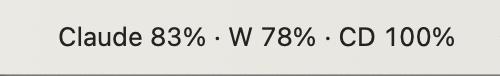
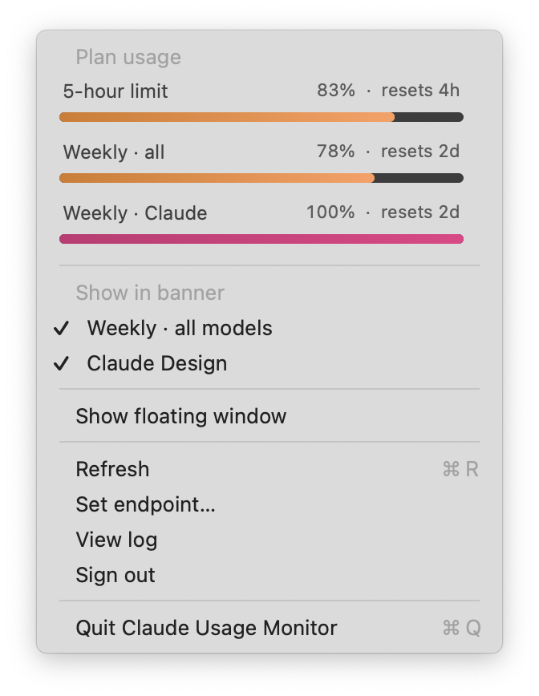
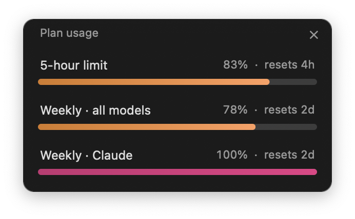

# Claude Usage Monitor

A tiny macOS menu-bar app that shows your **claude.ai plan usage in real time** — the same numbers you'd see on the *"Plan usage"* widget inside claude.ai, but always one glance away in your menu bar.

<p align="center">
  
</p>

The status-bar title always shows your **5-hour** percent. You can pin extra metrics (Weekly · all models, Claude Design, …) so they live up there too. Click the icon for the full breakdown, or pop out a small always-on-top floating window if you want to keep an eye on it without the menu open.

---

## Features

- **Lives in the menu bar.** No Dock icon, no ⌘-Tab entry — just a small percentage next to your other status items.
- **Always-current.** Polls claude.ai's internal usage endpoint every 60 seconds.
- **Multiple metrics.** 5-hour, weekly all-models, weekly Opus / Sonnet / Haiku, Claude Design, API apps, Cowork — whatever your plan exposes, the dropdown lists it with its own progress bar and reset countdown.
- **Pin what you care about.** Tick a metric in the menu and its short label shows up in the status-bar title alongside the 5-hour percent.
- **Optional floating window.** A small dark, rounded, always-on-top panel that mirrors the dropdown, draggable anywhere on screen.
- **One-click sign-in.** On first launch, click *Detect my session* and the app reads your claude.ai cookie from any browser you're already signed in to (Arc, Chrome, Brave, Edge, Firefox, Safari). No password, no token-crafting.
- **Secure storage.** The session key goes into the macOS Keychain — never written to disk in plaintext.
- **Self-healing endpoint discovery.** Claude's usage API isn't public, so the app tries a curated list of likely URL shapes and, if those all fail, scrapes claude.ai's own JS bundles to find the right one. The discovered endpoint is cached for next time.
- **No build step required.** Double-click the `.app`, accept the one-time Python venv setup, and you're running.

## Screenshots

| Menu bar | Dropdown | Floating window |
| --- | --- | --- |
|  |  |  |

## Install

### Option A — download the pre-built app (easiest)

1. Grab the latest `Claude.Usage.Monitor.app.zip` from the [**Releases**](../../releases) page.
2. Unzip it and drag **Claude Usage Monitor.app** into `/Applications`.
3. The first time you open it, macOS will warn that the app is from an unidentified developer (it's ad-hoc signed, not notarized — see *Trust* below). Right-click → **Open** → **Open** to bypass the warning once.
4. Click *Detect my session* in the connect window. If you're signed in to claude.ai in any browser, you're done.

### Option B — build it yourself

Requires macOS 12+ and Python 3.9+.

```bash
git clone https://github.com/<your-username>/claude-usage-monitor.git
cd claude-usage-monitor
./build.sh
open "Claude Usage Monitor.app"
```

`build.sh` assembles the `.app` bundle from `app.py`, `login.html`, `launcher`, `Info.plist`, and `AppIcon.icns`, then ad-hoc signs it. Python dependencies are installed automatically into a private virtualenv the first time you launch the app.

## How it works

`app.py` is a single-file PyObjC app. On launch:

1. If no `sessionKey` is in the macOS Keychain, it opens a small `pywebview` window (`login.html`) that either auto-detects your session via `browser-cookie3` or accepts a manual paste from DevTools.
2. It calls `https://claude.ai/api/organizations` to find your org UUID, then iterates a list of candidate `…/usage`-style endpoints until one returns a parseable response. The winning URL is cached in `~/.claude-usage-monitor/config.json`.
3. It opens an `NSStatusItem` with a custom dropdown menu — each row is a small Cocoa view with a label, percent, reset-time, and a gradient progress pill (blue / orange / magenta depending on utilization).
4. A background thread re-fetches usage every 60 seconds and pushes a new payload onto the main thread.

Cloudflare blocks vanilla `requests` calls to claude.ai, so HTTP traffic goes through `curl_cffi` (which mimics a real Chrome TLS fingerprint).

## File layout

```
.
├── app.py             — the whole app (PyObjC + AppKit menu-bar UI + API client)
├── login.html         — first-run pywebview window (auto-detect or manual paste)
├── launcher           — bash script that bootstraps a venv and runs app.py
├── Info.plist         — bundle metadata (LSUIElement = menu-bar-only)
├── AppIcon.icns       — app icon
├── requirements.txt   — Python deps installed into the per-user venv
├── build.sh           — assembles & ad-hoc signs the .app bundle
└── screenshots/       — README assets
```

Runtime state (the session key in Keychain, plus a small JSON config and debug log) lives at `~/.claude-usage-monitor/`.

## Trust

This is a personal project, not an official Anthropic tool. Things you should know before installing:

- The pre-built `.app` is **ad-hoc signed only** — it isn't notarized, so macOS Gatekeeper will warn you on first launch. If that worries you, build it yourself with `./build.sh`; the source is the same.
- The app talks to **claude.ai's internal API**, which isn't public. If Anthropic changes the endpoint shape, the app will surface a clear error in the dropdown and the *Set endpoint…* menu item lets you paste the new URL from your browser's DevTools.
- Your `sessionKey` lives in your **macOS Keychain** under the service name *"Claude Usage Monitor"*. The app never sends it anywhere except claude.ai. *Sign out* (in the menu) wipes the key.

## Privacy

The app talks to `https://claude.ai/api/...` and nothing else. No telemetry, no analytics, no third-party services. Read [`app.py`](app.py) — it's one Python file.

## Troubleshooting

- **"Session expired — sign out & relaunch"** — your claude.ai cookie aged out. Use *Sign out* in the menu and the connect window will reappear on next launch.
- **"Could not auto-discover the usage endpoint"** — open claude.ai in your browser, open DevTools → Network, refresh, look for a fetch with `usage` or `quota` in the path, and paste that URL via *Set endpoint…* in the menu.
- **Detect-my-session can't find Safari cookies** — macOS hides Safari's cookie file unless the app has Full Disk Access. The connect window has a button that opens the right Settings pane; drag *Claude Usage Monitor.app* into the list and try again.
- **Anything else** — `View log` in the menu opens `~/.claude-usage-monitor/debug.log`.

## Limitations

- macOS only.
- Personal claude.ai accounts only — Team / Enterprise accounts may have a different endpoint shape (the auto-discovery should still find it, but feedback welcome).
- The app requires Python 3 on the system. `launcher` looks in a few common locations (Homebrew, `/usr/bin/python3`); if it can't find one, it'll prompt you to install it.

## Contributing

Issues and PRs welcome — especially for new endpoint shapes, additional limit-key labels, or screenshots from other plans.

## License

MIT — see [LICENSE](LICENSE).

## Acknowledgements

This project was scaffolded with [Claude Code](https://www.claude.com/claude-code). It is not affiliated with or endorsed by Anthropic. *Claude* is a trademark of Anthropic, PBC.
